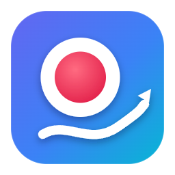

<p align="center">
  
</p>

# 쏙레코더 (SsokRecorder)

강의·튜토리얼 제작에 맞춘 화면 녹화·편집기입니다. Windows에서 녹화하고, 한국어 자막·단계 마커·TTS 나레이션·라이브 판서를 붙여 유튜브용으로 내보냅니다.

A screen recorder and editor for lectures and tutorials: Korean auto-captions, step markers with YouTube chapters, TTS narration, and a live pen for drawing on screen while recording.

Made by **[ssok.ai](https://ssok.ai)** · 만든 곳: [ssok.ai](https://ssok.ai)

## Based on Recordly / 원본 프로젝트

**쏙레코더는 [Recordly](https://github.com/webadderallorg/Recordly)(© 2026 webadderall)를 수정해 만든 프로그램입니다.** Recordly는 Siddharth Vaddem의 OpenScreen 프로젝트에서 시작되었습니다.

SsokRecorder is a modified version of [Recordly](https://github.com/webadderallorg/Recordly) by webadderall, which started as a fork of OpenScreen by Siddharth Vaddem. "Recordly" is the original project's name; this project does not use the Recordly name or branding for itself.

- 원본 README: [docs/upstream/RECORDLY_README.md](docs/upstream/RECORDLY_README.md)
- 원본에서 수정한 시작 지점: Recordly `18884285` (v1.4.0)

## License / 라이선스

이 프로그램은 원본과 같은 **GNU Affero General Public License v3.0**으로 배포됩니다. 전문과 원본의 추가 조건은 [LICENSE.md](LICENSE.md), 제3자 구성요소는 [THIRD_PARTY_NOTICES.md](THIRD_PARTY_NOTICES.md)를 보세요. 앱 안에서는 대시보드 → 설정 → **정보**에서 원본 출처와 라이선스를 확인할 수 있습니다.

Distributed under the GNU AGPL v3.0, the same license as Recordly. Anyone who receives the app has the right to its complete corresponding source code, published at https://github.com/Choulon04/ssok-recorder.

## Changes from Recordly / 수정 내역

AGPL-3.0 §5(a)에 따른 수정 고지입니다. 모든 변경은 2026-10-01 ~ 2026-10-03에 이루어졌으며, 세부 내용은 git 기록에 있습니다.

| 날짜 | 내용 |
|---|---|
| 2026-10-01 | 쏙레코더로 리브랜딩, 원본 업데이트·공지·로그인·클라우드 연결 비활성화 |
| 2026-10-01 | 한국어 자막 기본값, whisper 모델 선택, 녹화 후 자동 자막, 한글 토큰 깨짐 수정 |
| 2026-10-01 | 단계(챕터) 마커와 유튜브 챕터 목록 |
| 2026-10-01 | Fish Audio TTS 나레이션 |
| 2026-10-01 | 유튜브용 원클릭 내보내기(자막·챕터 파일 동시 저장) |
| 2026-10-01 | 녹화 중 라이브 판서 펜, 툴바 녹화 옵션, Ctrl+Alt 도구 단축키 |
| 2026-10-03 | 자체 아이콘·커서·배경화면으로 교체(OS 제조사 자산 제거), 앱 내 출처·라이선스 표시 |

## Build / 빌드

Windows: Visual Studio 2022 Build Tools (C++ workload, CMake), Node.js.

```bash
npm install
npm run dev
npm run build:win -- --publish never
```
